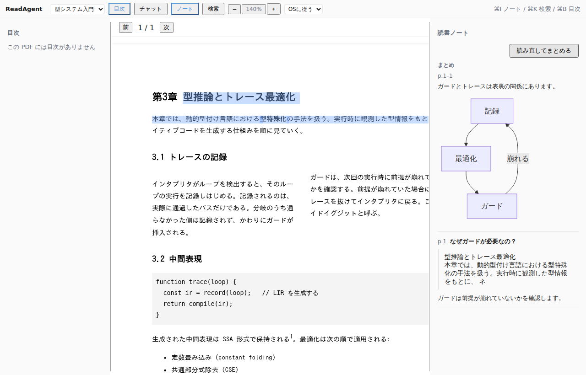
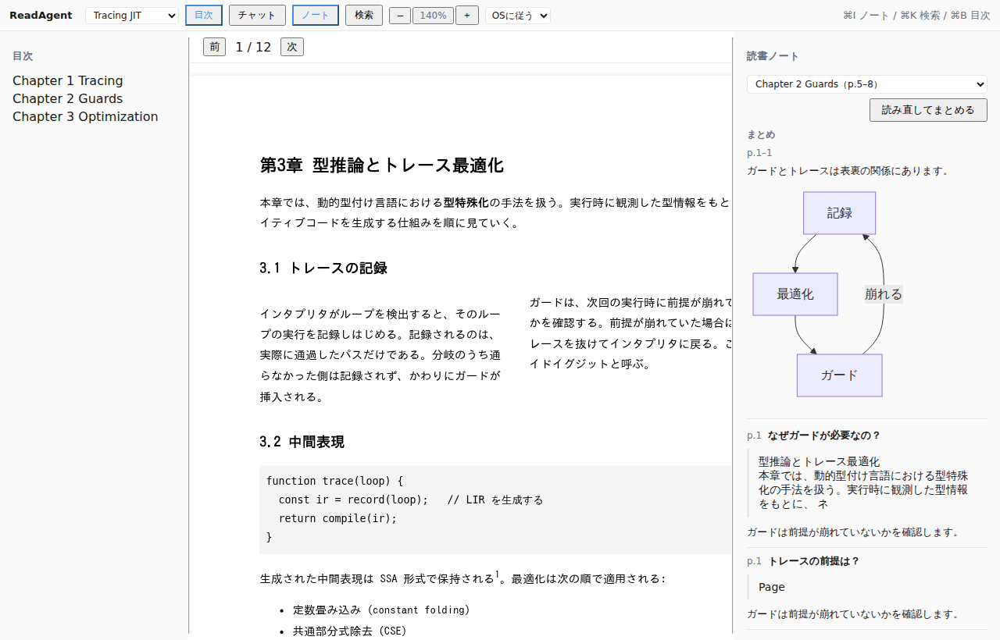

# 0009. ノートの再構成は書き換えではなく追記で行う

- **Status**: Accepted
- **Date**: 2026-08-10

## Context

要件 6 Phase 4 の「ノートの再構成（タグ・章単位のサマリ生成）」を実装するにあたり、
ADR-0006 で決めた「ノートは追記しかしない」と正面からぶつかった。

再構成の置き場所には3つの案があった。

1. 既存のエントリを読み直して、ノート全体を書き換える
2. まとめを別ファイル（`notes.summary.md` など）に書く
3. まとめを同じノートの末尾に追記する

ADR-0006 が追記しか行わないと決めたのは、**利用者が手で編集してよい**ことを保証するため。
書き換えを許した瞬間、この保証は消える。エージェントが要約のついでに
利用者の書いたメモを整理してしまう事故は、起きてからでは取り返しがつかない。

## Decision

**再構成は、まとめのエントリを末尾に追記することとする。既存の記録には触れない。**

- 見出しは `## まとめ p.<from>–<to>`
- 対象範囲の目印として `<!-- readagent:summary pages=<from>-<to> -->` を埋め込む
- 読み戻しは `parseSummaries` で行い、読書エントリ（`parseEntries`）とは別に数える

再構成のときエージェントに渡すのは既存のノートだけで、外部を引くツールは渡さない。
ノートに書かれていないことを持ち込ませないため。

まとめは既存のエントリの**上**に積まれるのではなく、同じ流れの中に並ぶ。
下の画面では「まとめ p.1–1」が先頭に、その後ろに元の質問と引用がそのまま残っている。

目次のページ解決ができたので、範囲を章で切れるようになった（下の選択欄）。
選べるのは `TocEntry.page` が解決できた PDF だけで、それ以外は従来どおり
「エントリの最小ページ〜最大ページ」になる。

## Consequences

- ADR-0006 の「手で編集してよい」がそのまま保たれる
- 再構成を何度でも試せる。気に入らなければ、そのまとめだけを手で消せばよい
- **まとめが増えると、ノートに同じ話が何度も並ぶ。** 古いまとめを自動で消す仕組みは持たない。
  整理は利用者の手に委ねる。自動で消すのは、書き換えを許すのと同じ危うさがある
- タグの集約は、この時点ではまとめ本文の中に書かれるだけで、構造としては持たなかった。
  その後 `extractTags` / `collectTags` で取り出し、UIで絞り込めるようにしている
- まとめの対象範囲は、既定では「ノートにあるエントリの最小ページ〜最大ページ」。
  目次からページを解決できる PDF では、章を選んでその範囲に絞れる
  （この ADR の時点では未解決で、後から入れた）

## Alternatives considered

- **ノート全体を書き換える** — もっとも読みやすい結果になるが、利用者の記述を失う危険がある。
  この道具は読書記録を預かる立場なので、その危険は取らない
- **別ファイルに書く** — 書き換えの危険は無いが、ノートが2つに割れる。
  「後から通して読み返す1冊の記録」（ADR-0006）という性格から外れる
