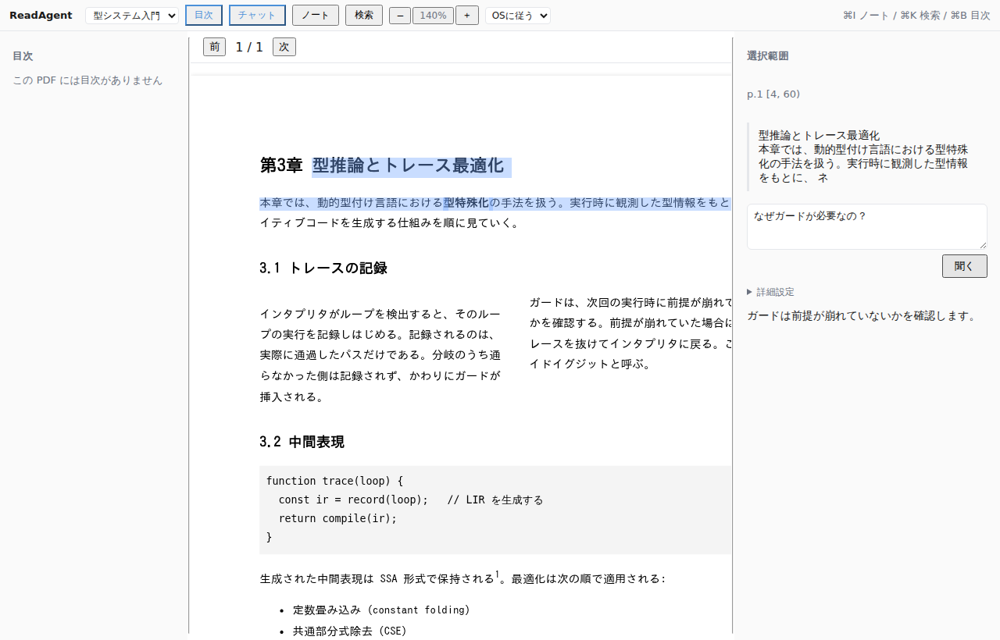
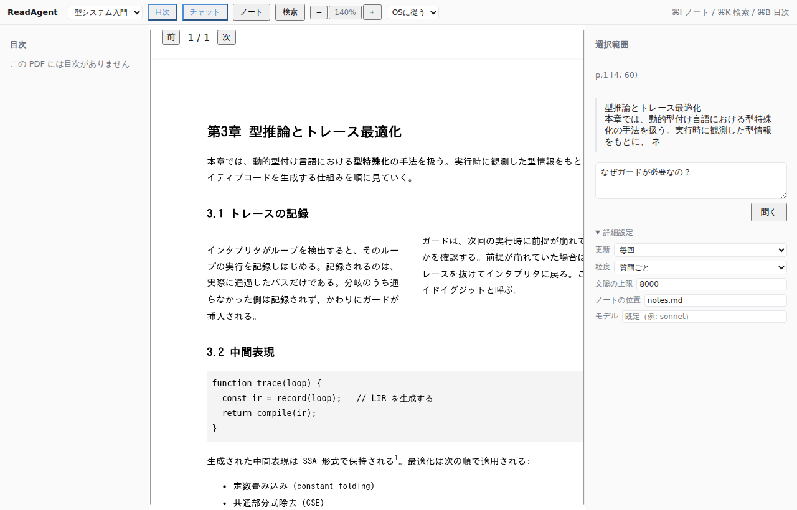
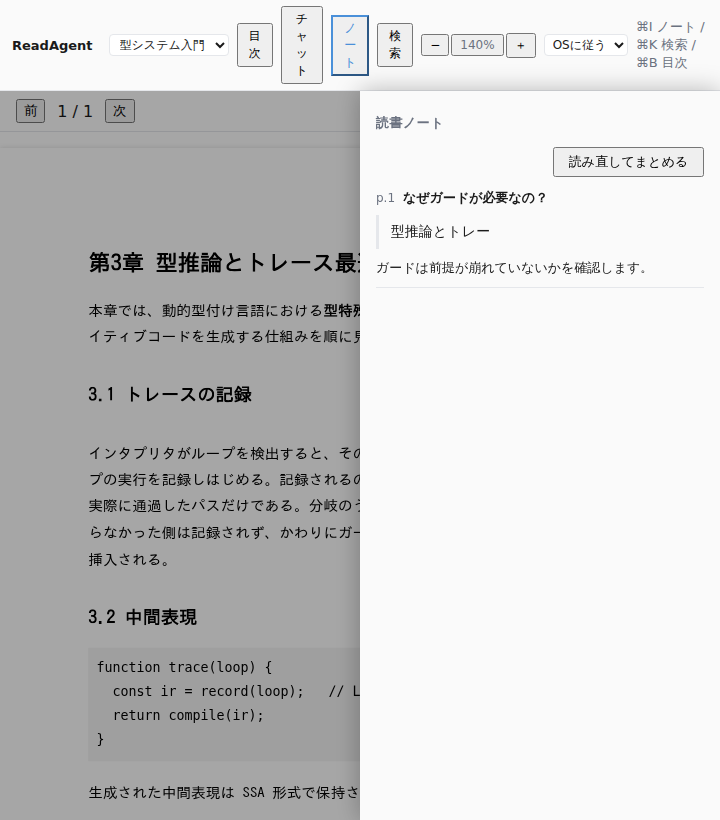

# 0010. 表示設定はブラウザ側に置き、ノートの設定と混ぜない

- **Status**: Accepted
- **Date**: 2026-08-10

## Context

ペインの幅を保存したい、という要望が出た。保存先の候補は2つあった。

1. 既にある設定の階層（グローバル → 書籍 → スコープ、要件 3.4）に混ぜる
2. ブラウザの `localStorage` に別途置く

既存の設定は `NoteConfig`（`updateMode` / `granularity` / `notePath` / `maxContextChars`）で、
**ノートとエージェントの振る舞い**を決めるものである。サーバー側で解決し、
書籍の隣の `.readagent.json` に書ける。

一方でペインの幅は、書籍にもノートにも関係しない。同じ書籍を
大きな画面と小さな画面で読めば、望ましい幅は違う。

## Decision

**設定を2つの層に分ける。**

| | 置き場所 | 性質 |
| --- | --- | --- |
| ノートの設定 | 設定ファイル（グローバル/書籍）・環境変数・UIの一時上書き | 読書の**結果**に影響する。共有・バージョン管理の対象 |
| 表示設定 | ブラウザの `localStorage` | その**端末での見え方**。共有しない |

表示設定のキーには `readagent:` を接頭辞として付ける。
読み出しは必ず検証を通し、壊れた値・型の合わない値は既定値に落とす。

いま置いているのは次の5つ。

| キー | 内容 |
| --- | --- |
| `readagent:pane-widths` | 目次ペインとサイドペインの幅 |
| `readagent:zoom` | 本文の拡大率（ヘッダーの `−` / `＋`） |
| `readagent:theme` | 配色（OSに従う / 明るい / 暗い） |
| `readagent:panes` | 開いていたペイン（目次と、チャット / ノート / 検索） |
| `readagent:last-pages` | 書籍ごとの続きのページ |

拡大率と配色はヘッダーから、幅はペインの境界のドラッグから変える。
開いていたペインと続きのページは、操作の結果として黙って記録される。

一方で、下の「詳細設定」はノートの設定であって表示設定ではない。
同じ画面に並んでいても保存先が違う（こちらは保存せず、その問い合わせにだけ効く）。

`localStorage` が使えない場合（プライベートモード、無効化、容量超過）は黙って諦める。
表示設定が保存できないことは、読書を止める理由にならない。

## Consequences

- 「ノートの設定は書籍と一緒に持ち運べる」「表示設定は端末ごと」という区別が保てる
- 開いていたペインを復元するため、**狭い画面では復元した状態の整合を取り直す必要が出た。**
  目次とサイドを両方開いた状態を狭い画面で復元すると、本文が完全に隠れる（要件 4）。
  復元後にサイドを優先して目次を畳む

  
- 表示設定を増やすときサーバーに触らなくてよい。追加のコストが小さい
- **端末をまたいで表示設定は引き継がれない。** 同期が必要になったら、
  そのとき初めてサーバー側へ移す判断をする
- ブラウザの保存領域を消すと既定値に戻る。失われて困るものはここに置かない

## Alternatives considered

- **既存の設定階層に混ぜる** — 保存先が1つで済むが、書籍の `.readagent.json` に
  ペインの幅が書かれることになる。書籍と一緒に配る設定に、端末固有の値が混ざる
- **サーバー側に利用者ごとの設定を持つ** — 端末間で同期できるが、
  いまは利用者の概念すら無い（ローカル完結、ADR-0004）。必要になってから
